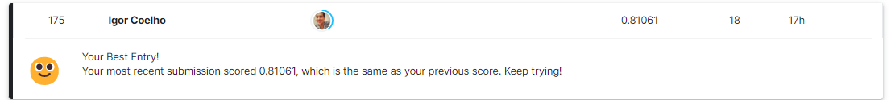

# Spaceship Titanic

#### Introdução

Bem-vindo ao ano 2912, onde suas habilidades em ciência de dados são necessárias para resolver um mistério cósmico. Recebemos uma transmissão a quatro anos-luz de distância e as coisas não estão boas.

O navio espacial Titanic foi um navio de passageiros interestelar lançado há um mês. Com quase 13.000 passageiros a bordo, o navio partiu em sua viagem inaugural transportando imigrantes de nosso sistema solar para três exoplanetas habitáveis ​​recentemente descobertos orbitando estrelas próximas.

Enquanto passava pelo Alpha Centauri, a caminho de sua primeira destinação, o 55 Cancri E, o desavisado navio espacial Titanic colidiu com uma anomalia do espaço-tempo escondida dentro de uma nuvem de poeira. Infelizmente, teve um destino semelhante ao de seu homônimo 1000 anos antes. Embora o navio tenha permanecido intacto, quase metade dos passageiros foi transportada para uma dimensão alternativa!

#### Objetivo

Para ajudar as equipes de resgate e recuperar os passageiros perdidos, você é desafiado a prever quais passageiros foram transportados pela anomalia usando registros recuperados do sistema de computador danificado do navio espacial.
Ajude a salvá-los e mude a história!

#### Dicionário dos dados

* PassengerId: Id único para cada passageiro. Cada Id é no formato gggg_pp, onde gggg indica um grupo com o qual o passageiro está viajando e pp é o número dele dentro do grupo. Pessoas em um grupo geralmente são familiares, mas nem sempre.

* HomePlanet: O planeta de onde o passageiro partiu, geralmente o planeta de residência permanente.

* CryoSleep: Indica se o passageiro optou por ser colocado em animação suspensa durante a viagem. Passageiros em animação suspensa ficam confinados em suas cabines.

* Cabin: O número da cabine onde o passageiro está ficando. Tem o formato deck/num/side, onde side pode ser P para Porto ou S para Estibordo.

* Destination: O planeta para onde o passageiro desembarcará.

* Age: A idade do passageiro.

* VIP: Se o passageiro pagou por serviço VIP especial durante a viagem.

* RoomService: RoomService, FoodCourt, ShoppingMall, Spa, VRDeck: Quantia que o passageiro cobrou em cada uma das muitas comodidades de luxo do navio espacial Titanic.

* Name: O primeiro e último nome do passageiro.

* Transported: Se o passageiro foi transportado para outra dimensão. Este é o alvo, a coluna que você está tentando prever.

#### Resultados

Após a criação do modelo foi feito o submission do arquivo no link da competição do Kaggle no qual atingimos a acurácia de 0.81061.

## Link da Competição

 - [Spaceship Titanic](https://www.kaggle.com/competitions/spaceship-titanic/overview)